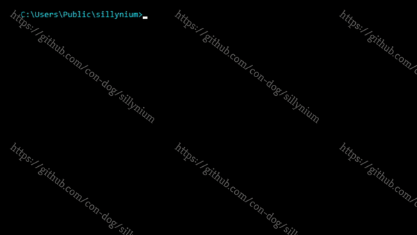
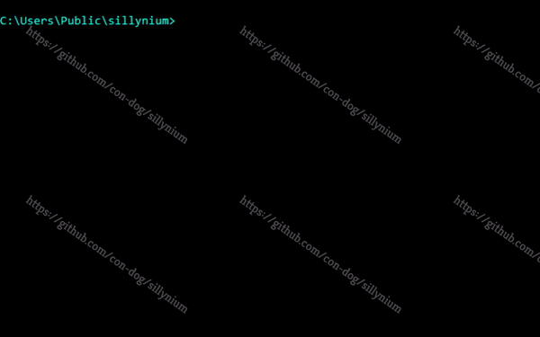

<p align="center">
  
</p>

# Sillynium 
Automatically generate python selenium scripts by drawing coloured boxes around webpage elements. 

See [ROADMAP](ROADMAP.md) for how it works, vision, and TODO.

| V1 (End-of-life)     | V2 (Work-in-progress) |
| ----------- | ----------- |
|<p align="center"></p>|<p align="center"></p>|
| Draws on a *screenshot of a webpage* | Draws *directly on webpage* |


## Status
***Work-in-progress:***
- Currently loads a given URL, and injects JavaScript, which allows you to draw on any given webpage. Please see [ROADMAP](ROADMAP.md)
- Accepting contributions, created as an open-source project


## Roadmap
***Important! Please read the [ROADMAP](ROADMAP.md)***
- Plan and vision inside
- Currently only draws grey boxes to webpages - requires further work.


## Usage
In console / bash to install libraies required:
```CMD
C:\Path-to-sillynium>
C:\Path-to-sillynium>pip install -r requirements.txt
```

#### sillynium.py ####
Run as you would any other python file - currently under development
- Chromedriver will launch Chrome + URL
- You can now draw boxes to that webpage directly
- Does nothing more yet! Please see [ROADMAP](ROADMAP.md)

#### concept/poc.py ####
A proof of concept and will not be developed further.
- Draws on screenshot of webpage window
- It may fail on your OS as it was only coded to handle Windows 10 and Chrome
- For instructions, see [poc_instructions](concept/poc_instructions.md)


## Contributing
Please see [CONTRIBUTING.md](CONTRIBUTING.md)

- Ideal contributors: Know any of Python, HTML, JavaScript
- All welcome however

Pull requests are welcome. For major changes, please open an issue first to discuss what you would like to change.


## License
Distributed under the [GNU-GPLv3](https://www.gnu.org/licenses/gpl-3.0.en.html) License. See [LICENSE](LICENSE) for more information.


## External Credits
- [Mihai Sucan: Creating an HTML5 Canvas Painting Application](https://dev.opera.com/articles/html5-canvas-painting/) : Followed this tutorial to create the Painting Canvas!
