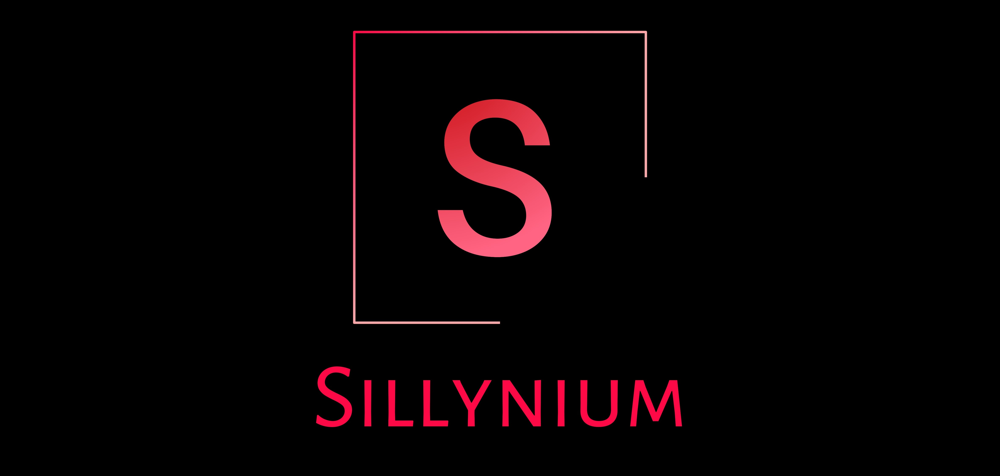

  

# Sillynium 
Automatically generate python selenium scripts by drawing coloured boxes around webpage elements. Please see [ROADMAP](ROADMAP.md) for how it works and what still needs to be done.

## Status
***Work-in-progress:***
- Currently loads a given URL, and injects JavaScript, which allows you to draw on the webpage. Please see [ROADMAP](ROADMAP.md)

***Contributing***
- Contributions to files in **sillynium directory** are open! Please see [CONTRIBUTING](CONTRIBUTING.md)

## Usage
***Read the [ROADMAP](ROADMAP.md) first*** 

### sillynium.py ###
Simply run as you would any other python file
- Chromedriver will launch Chrome + URL
- You can now draw rectangles to that webpage - does nothing more yet! Please see [ROADMAP](ROADMAP.md)

### concept/poc.py ###
**NOTE:** [poc.py](concept/poc.py) is a ***proof of concept only*** and will not be developed further. 
- It was created in 1 night just to test the concept of auto-generating selenium scripts and has served its purpose.
- It may **fail on your OS as it was only coded to handle Windows 10 and Chrome**
- Run it anyway to play around and see how it works. It may inspire a better approach for sillynium.py
- For instructions, see [poc_instructions](concept/poc_instructions.md)

## Roadmap

Please see [ROADMAP](ROADMAP.md)

## Contributing

Please see [CONTRIBUTING.md](CONTRIBUTING.md)

Pull requests are welcome. For major changes, please open an issue first to discuss what you would like to change.

Please make sure to update tests as appropriate.

## License

Distributed under the [GNU-GPLv3](https://www.gnu.org/licenses/gpl-3.0.en.html) License. See [LICENSE](LICENSE) for more information.

## External Credits
- [Mihai Sucan: Creating an HTML5 Canvas Painting Application](https://dev.opera.com/articles/html5-canvas-painting/) : Followed this tutorial to create the Painting Canvas!
