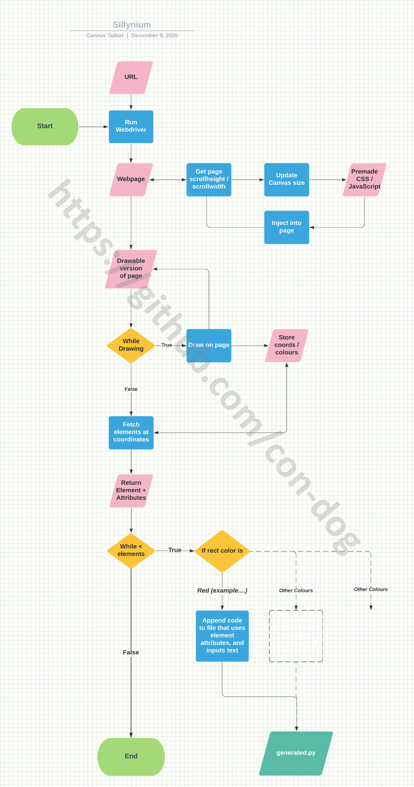
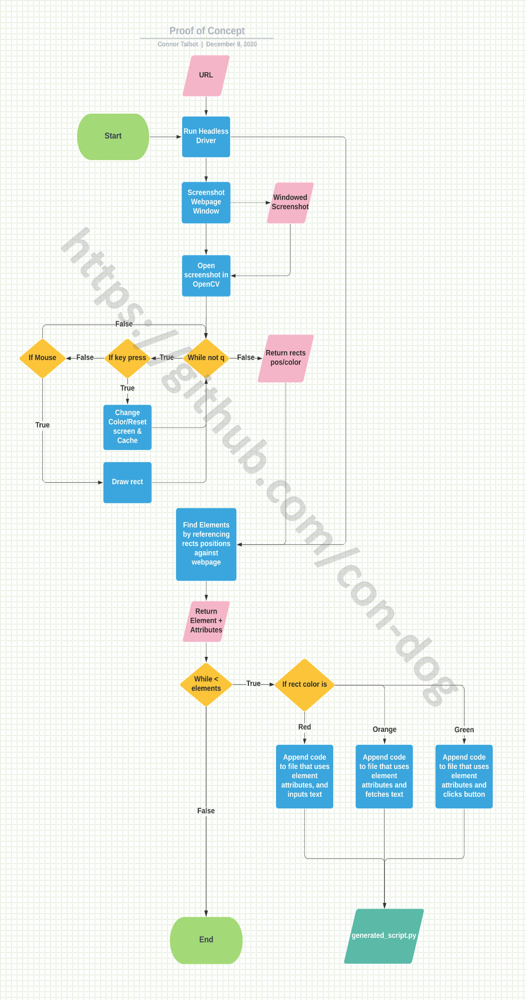

# ROADMAP

Pre-warning. This project is ambitious.

# Table of contents
1. [How it Works](#HOW)
2. [Sillynium](#Now)
3. [TODO](#TODO)
4. [Future Ideas](#Future)
5. [Previous Iterations - Proof of Concept](#POC)

## 1.0 How it Works <a name="HOW"></a> ##

1. Launches webdriver browser and redirects to given Url
2. Injects an iframe containing a Canvas and JS infront of the body - basically turns the whole page into a drawable canvas
3. Now can draw boxes on page around different elements, and change colours for different actions
4. Close browser
5. Converts to code based on boxes location amd colours 
  
For those of you that are visual:


## 2.0 Sillynium <a name="Now"></a>
[sillynium.py](sillynium.py) is the natural extension to the proof of concept, and draws directly to the webpage.

This comes with quite some complexity however. The current working approach to achieve this is as follows:
- Load URL via Selenium Webdriver
- Retrieve webpage body's scrollheight and scrollwidth values
- Inject a transparent iframe into webpage, with dimensions the exact size of the page body, and position matching body
- irfame src is a srcdoc, which contains an HTML doc, which contains a canvas and javascript to draw to that canvas
- Set iframe z-index very high, to place it as the top-most element in the page
- iframe and canvas are both transparent, so page beneath can still be seen

*As crazy as it sounds*, ***it works!*** The webpage can be drawn on! But there is still work to be done!

The iframe content is developed in a completely separate file called [draw_rect.html](HTML\CSS\JS/draw_rect.html). The way to achieve desired functionality is to ensure it works in isolation (ie: If I load [draw_rect.html](HTML\CSS\JS/draw_rect.html), can I draw on the screen?). When this file works, the iframe content is ported over to the [sillynium.py](sillynium.py) file and executed via driver.execute_script().

***Easy right?***

## 3.0 TODO<a name="TODO"></a>
Most of the work TODO is actually on the HTML/CSS/JS side. This work then needs to be ported over to the [sillynium.py](sillynium.py) file. 

Heres a pretty good timeline and idea of what needs to be done - contribute where and if you can!


### 3.1 [draw_rect.html](HTML\CSS\JS/draw_rect.html) - Fix issue where canvas does not cover small top part of window ###
I believe this is caused by the label for drawing tool potentially offsetting the canvas? Needs to be fixed so canvas covers entire page.

### 3.2 [draw_rect.html](HTML\CSS\JS/draw_rect.html) - Synchronise iframe scrolling with webpage (parent) scrolling ###
Right now only the iframe scrolls. The webpage and iframe must be in sync and scrolling together, so that boxes line up with the correct elements.

### 3.3 [draw_rect.html](HTML\CSS\JS/draw_rect.html) - Update to remove pencil functionality (not-used) ###
The pencil is an artifact of the paint to canvas tutorial, since we only need to draw boxes it should be removed to simplify the HTML document.

### 3.4 [draw_rect.html](HTML\CSS\JS/draw_rect.html) - Create a draggable toolbar ###
Eventually when the option toolbar is created, it must be moveable. If it is static, it may block requried page elements. 

### 3.5 [draw_rect.html](HTML\CSS\JS/draw_rect.html) - Add a simple colour picker for box (inside toolbar) ###
Currently we can draw Grey boxes. This single colour is not of much use, so we need to implement a simple colour picker inside our toolbar (just like MS paint) so we can choose our box colour. We only require about ~9-10 different colours (representing each element type)

### 3.6 [draw_rect.html](HTML\CSS\JS/draw_rect.html) - Collect drawn box/es coordinates + colours ###
Currently as we draw, we are not collecting the coordinates or colours of the box anywhere. This is required to later determine elements at each box position.

### 3.7 [draw_rect.html](HTML\CSS\JS/draw_rect.html) - Create undo function (inside toolbar) ###
Currently there is no way to undo an incorrect drawing. A simple undo function is required (inside toolbar) 

### 3.8 [draw_rect.html](HTML\CSS\JS/draw_rect.html) - Create reset function (inside toolbar) ###
Currently there is no way to reset the entire canvas. A simple reset function is required (inside toolbar)

### 3.9 [draw_rect.html](HTML\CSS\JS/draw_rect.html) - Create finish drawing function (inside toolbar) ###
Well great we have all these coloured boxes, but no way to save our drawings and mvoe to the next step. Lets fix that by adding a finish drawing button within our toolbar.

### 3.10 [sillynium.py](sillynium.py) - Configure boiler-plate code ###
The majority of Python Selenium scripts feature some repeating code such as:
```python
from selenium import webdriver
from webdriver_manager.chrome import ChromeDriverManager

# set up webdriver options
options = webdriver.ChromeOptions()
options.headless = False
options.add_experimental_option("excludeSwitches", ['enable-automation'])
```
lets determine what should be included in the boiler-plate as a community. 
Perhaps this could even be saved in a config.ini file which is called by the script

### 3.11 [sillynium.py](sillynium.py) - Fetch all elements based on their positions ###
This could be based off the existing code in [concept/poc.py](concept/poc.py) which does the same already.

### 3.12 [sillynium.py](sillynium.py) - Determine colour rules ###
This could be based off the existing code in [concept/poc.py](concept/poc.py). Determine what colours apply to what elements, and best methods for performing an action based on box colour.

### 3.13 [sillynium.py](sillynium.py) - Determine script generation rules ###
This could be based off the existing code in [concept/poc.py](concept/poc.py). Determine what script generation rules should be implemented.

## 4.0 Future Ideas <a name="Future"></a>##
All the current ideas for future features go here.

- Convert to browser extension
- Add support for more languages (Java)

## 5.0 Previous Iterations - Proof of Concept <a name="POC"></a>
[concept/poc.py](concept/poc.py) is a proof of concept program. However, it is a good starting point to show the inspiration behind ***sillynium***.

poc.py fetches the desired URL in the background, by running selenium webdriver in headless mode. It then gets a screenshot of the current window *ONLY*.
This screenshot is an *exact* representation of that window. You draw coloured boxes on this screenshot, and as you draw, the coordinates and colours are recorded. 

Each colour has a *different function* - *red* is used for locating "text-input" elements, *green* is used for locating "button" elements, for example. Once drawing is complete, you exit the drawing window, and the recorded coordinates are cross-checked against the actual elements at that position in the headless driver, and the element is returned. This is repeated for all elements. 

Now that we have all the elements (and all their possible attributes if we so desire), we enter the script generating area of the code. The colour of the box is used to tell the script generating part of the program what to do with each element. Back to our *red* example, this tells the script generator *"the element that corresponds to the red box at position (x, y) is an input-text element, so write code to represent that functionality."* This is repeated for each box that was drawn. What you end up with is some boiler-plate code, and your generated code. This is all combined into your brand new selenium automation script called *"generated.py"*.

See [concept/poc.py](concept/poc.py) to run it and test it out. You will discover very quickly that it is limited, and a webpage screenshot is a dead-end. That is why moving forward, sillynium must work by drawing directly to the webpage. See [Sillynium](#Now) about how this can be achieved.

For those of you that are visual:
