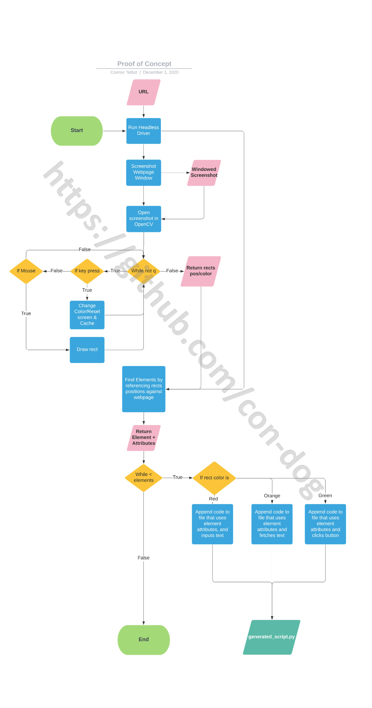

# ROADMAP

# Table of contents
1. [Proof of Concept](#POC)
2. [Sillynium](#Now)
3. [Sillynium's Future](#Future)

## 1.0 Proof of Concept 
[concept/poc.py](concept/poc.py) is a proof of concept program. However, it is a good starting point to show the inspiration behind ***sillynium***.

poc.py fetches the desired URL in the background, by running selenium webdriver in headless mode. It then gets a screenshot of the current window *ONLY*.
This screenshot is an *exact* representation of that window. You draw coloured boxes on this screenshot, and as you draw, the coordinates and colours are recorded. 

Each colour has a *different function* - *red* is used for locating "text-input" elements, *green* is used for locating "button" elements, for example. Once drawing is complete, you exit the drawing window, and the recorded coordinates are cross-checked against the actual elements at that position in the headless driver, and the element is returned. This is repeated for all elements. 

Now that we have all the elements (and all their possible attributes if we so desire), we enter the script generating area of the code. The colour of the box is used to tell the script generating part of the program what to do with each element. Back to our *red* example, this tells the script generator *"the element that corresponds to the red box at position (x, y) is an input-text element, so write code to represent that functionality."* This is repeated for each box that was drawn. What you end up with is some boiler-plate code, and your generated code. This is all combined into your brand new selenium automation script called *"generated.py"*.

See [concept/poc.py](concept/poc.py) to run it and test it out. You will discover very quickly that it is limited, and a webpage screenshot is a dead-end. That is why moving forward, sillynium must work by drawing directly to the webpage. See [Sillynium](#Now) about how this can be achieved.

For visual learners, a visual representation [concept/poc.py](concept/poc.py) is below:

## 2.0 Sillynium 
[sillynium.py](sillynium.py)
